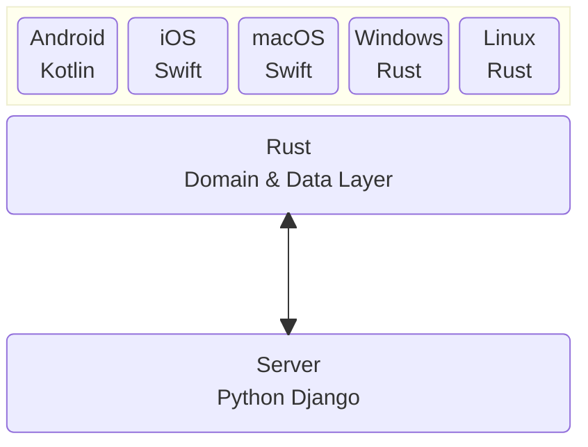

# LingoLessons Client Architecture

Initially the client was developed using Kotlin Multiplatform, however this came with the following shortcomings:

- Non native look and feel outside of Android.
- Non native executable format requiring Java to be installed on desktop targets.
- Very clumsy interop between Kotlin and native layers in case of using, say, a native iOS UI on a Multiplatform domain.

I considered switching to a Kotlin Native shared library consumed by the native toolkit of each platform. However the interop issue became quite cumbersome to deal with. Additionally, there would be oddities calling garbage collected code from native code of each platform.

I came to the conclusion that I wasn't willing to accept any of these issues, and decided to move to a shared domain/data layer written entirely in Rust. This affords native performance, native executables, higher efficiency, and easy platform sharing due to Rust's excellent portability.

UniFFI (https://mozilla.github.io/uniffi-rs) is used to generate bindings between Kotlin and Swift which makes interop seamless between UI and domain layers seamless despite being different toolchains.

 

